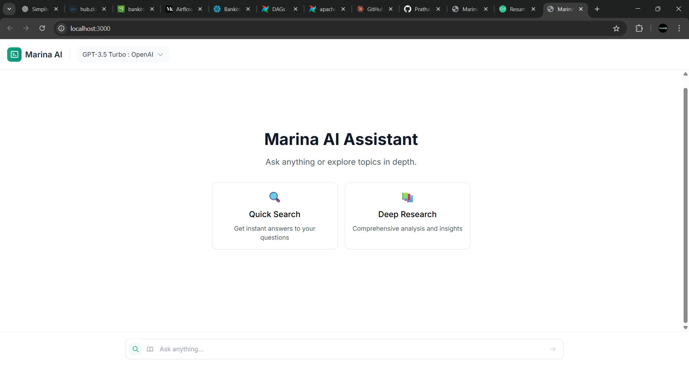
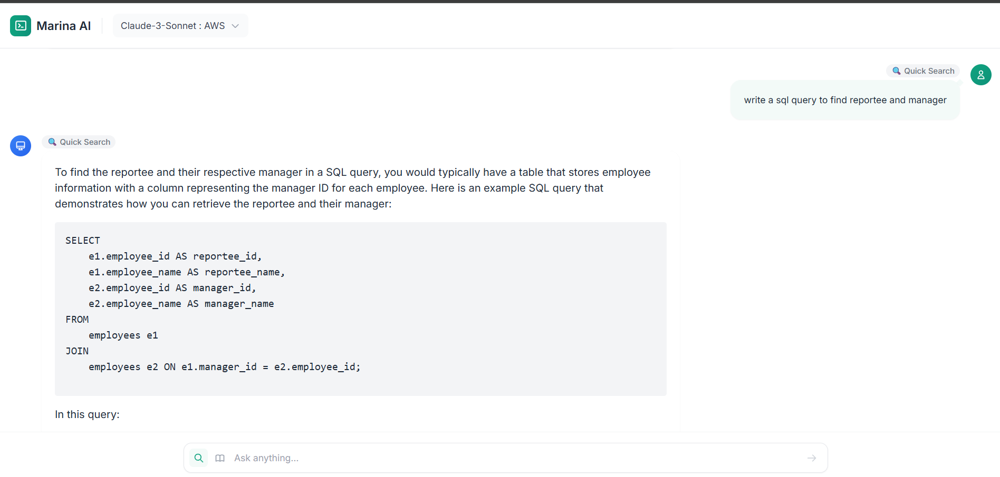
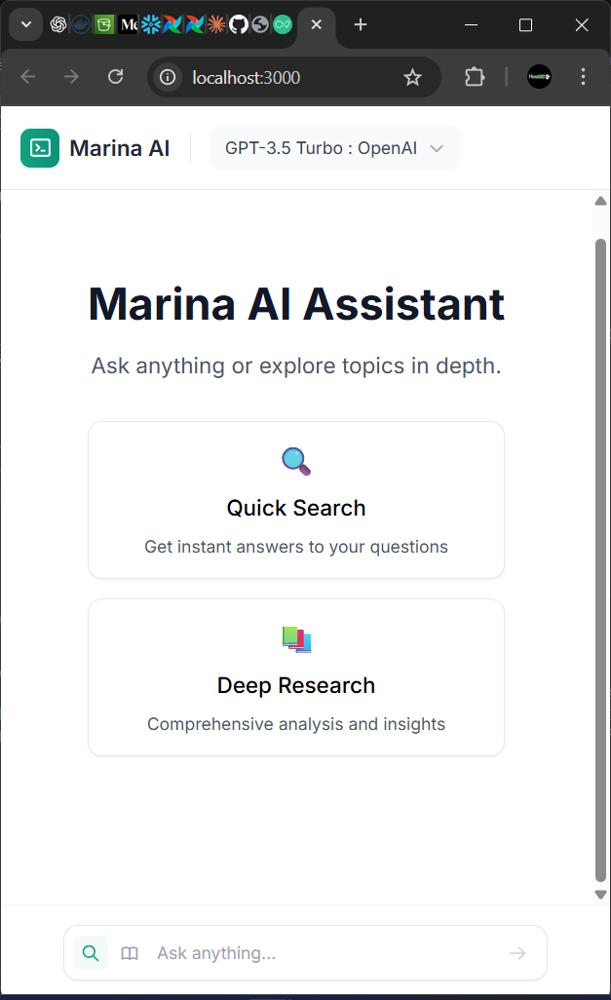
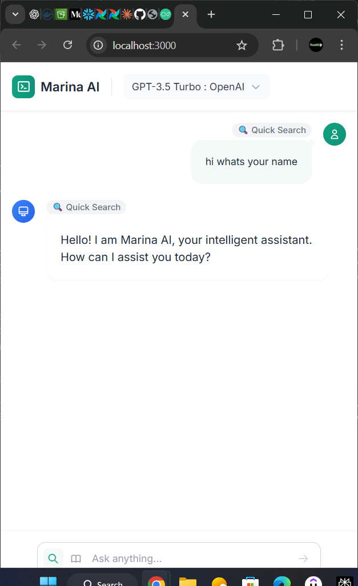

# Marina AI - Intelligent Research Assistant

<div align="center">


[](https://www.python.org/downloads/)
[](https://nextjs.org/)
[](CONTRIBUTING.md)

**A powerful research assistant that leverages multiple AI models to provide intelligent search capabilities and deep research analysis.**

[Features](#-features) • [Demo](#-demo) • [Quick Start](#-quick-start) • [Documentation](#-documentation) • [Roadmap](#-roadmap)

</div>

---

## 📹 Demo

### Video Walkthrough

<div align="center">

[](assets/login.mp4)

*Click to watch: Complete walkthrough of Marina AI features*

</div>

**Key Features Demonstrated:**
- 🔍 Intelligent web search with context-aware results
- 🧠 Deep research mode for comprehensive analysis
- 🎤 Voice command functionality
- 🤖 Multi-model AI integration
- 💬 Real-time chat interface

---

## 📸 Screenshots

### Main Interface

<div align="center">


*Clean, modern chat interface with AI-powered responses*

</div>

### Deep Research Mode

<div align="center">


*Comprehensive research reports with source citations*

</div>

### Search Results

<div align="center">

<table>
  <tr>
    <td></td>
    <td></td>
  </tr>
  <tr>
    <td align="center"><em>Instant search results</em></td>
    <td align="center"><em>AI-generated insights</em></td>
  </tr>
</table>

</div>

### Mobile Experience

<div align="center">

<table>
  <tr>
    <td></td>
    <td></td>
    
  </tr>
  <tr>
    <td align="center"><em>Home screen</em></td>
    <td align="center"><em>Chat interface</em></td>
   
  </tr>
</table>

</div>

---

## ✨ Features

<table>
<tr>
<td width="50%">

### 🔍 Intelligent Search
- Context-aware web search
- Multi-source aggregation via SearXNG
- Privacy-respecting search engine
- Real-time result processing

</td>
<td width="50%">

### 🧠 Deep Research
- Comprehensive topic analysis
- Multi-perspective insights
- Automated report generation
- Source citation tracking

</td>
</tr>
<tr>
<td width="50%">

### 🤖 Multiple AI Models
- **GPT-3.5** (OpenAI) - General purpose
- **Claude-3-7-sonnet** (AWS Bedrock) - Advanced reasoning
- **Deepseek** (OpenRouter) - Specialized research
- Easy model switching

</td>
<td width="50%">

### 🎨 Modern UI/UX
- Clean, intuitive interface
- Dark/Light mode support
- Responsive design
- Voice command integration
- Real-time streaming responses

</td>
</tr>
</table>

---

## 🚀 Quick Start

### Prerequisites

- Python 3.8 or higher
- Node.js 16+ and npm (for Next.js version)
- Web browser with JavaScript enabled
- Internet connection for AI model access

### Installation

#### Option 1: HTML Version (Flask Backend)

```bash
# Clone the repository
git clone https://github.com/PrathameshUpreti/Marina.git
cd marina-ai

# Install Python dependencies
pip install -r requirements.txt

# Set up environment variables
cp .env.example .env
# Edit .env and add your API keys

# Run the application
python app.py

# Access at http://localhost:5000
```

#### Option 2: Next.js Version

```bash
# Navigate to Next.js directory
cd nextjs

# Install dependencies
npm install

# Set up environment variables
cp .env.example .env.local
# Edit .env.local and add your API keys

# Start development server
npm run dev

# Access at http://localhost:3000
```

### Environment Variables

Create a `.env` file with the following:

```env
# OpenAI Configuration
OPENAI_API_KEY=your_openai_api_key

# AWS Bedrock Configuration
AWS_ACCESS_KEY_ID=your_aws_access_key
AWS_SECRET_ACCESS_KEY=your_aws_secret_key
AWS_REGION=us-east-1

# OpenRouter Configuration
OPENROUTER_API_KEY=your_openrouter_api_key

# SearXNG Configuration
SEARXNG_URL=http://localhost:8080

# Application Settings
FLASK_SECRET_KEY=your_secret_key
DEBUG=False
```

---

## 📁 Project Structure

```
marina-ai/
├── assets/
│   ├── banner.png
│   ├── video-thumbnail.png
│   ├── demo-video.mp4
│   └── screenshots/
│       ├── main-interface.png
│       ├── deep-research.png
│       ├── search-results.png
│       ├── ai-response.png
│       ├── mobile-1.png
│       ├── mobile-2.png
│       └── mobile-3.png
├── webui/
│   ├── app.html              # Main web interface
│   └── modern-ui.html        # Alternative UI design
├── nextjs/                   # Next.js version
│   ├── pages/
│   ├── components/
│   ├── styles/
│   └── public/
├── agent/
│   ├── prompt.py             # AI prompt templates
│   └── research.py           # Research functionality
├── app.py                    # Main Flask application
├── requirements.txt          # Python dependencies
├── .env.example              # Environment variables template
├── README.md                 # This file
└── LICENSE                   # MIT License
```

---

## 📚 Usage Guide

### Basic Search

1. **Type your query** in the chat input
2. **Press Enter** or click the send button
3. **Receive instant answers** with AI-powered insights


### Deep Research Mode

1. **Click "Deep Research"** button in the interface
2. **Enter your research topic** in detail
3. **Wait for comprehensive analysis** (may take 5 min)
4. **Review the generated report** with citations


### Voice Commands

1. **Click the microphone icon** in the input area
2. **Speak your query** clearly
3. **Review transcription** and confirm
4. **Get AI-powered responses**


### Switching AI Models

1. **Open settings panel** (gear icon)
2. **Select your preferred model**:
   - GPT-3.5 for general queries
   - Claude for advanced reasoning
   - Deepseek for research tasks
3. **Continue chatting** with the new model

---

## 🔧 Key Components

### SearXNG Integration

Marina AI uses **SearXNG**, a privacy-respecting metasearch engine that:

- Aggregates results from multiple search engines
- Protects user privacy (no tracking)
- Provides unbiased, comprehensive results
- Supports custom filtering and ranking

**Setup SearXNG:**

```bash
docker pull searxng/searxng
docker run -d -p 8080:8080 searxng/searxng
```

### AI Model Integration

| Model | Provider | Best For | Response Time |
|-------|----------|----------|---------------|
| GPT-3.5 | OpenAI | General queries, conversations | Fast |
| Claude-3-7-sonnet | AWS Bedrock | Complex reasoning, analysis | Medium |
| Deepseek | OpenRouter | Research, technical topics | Medium |

### Architecture Overview

```
┌─────────────┐      ┌──────────────┐      ┌─────────────┐
│   User      │─────▶│  Flask/Next  │─────▶│   AI Models │
│  Interface  │      │   Backend    │      │   (APIs)    │
└─────────────┘      └──────────────┘      └─────────────┘
                            │
                            ▼
                     ┌──────────────┐
                     │   SearXNG    │
                     │Search Engine │
                     └──────────────┘
```

---

## 🎨 Customization

### Changing Themes

Edit the CSS variables in `webui/app.html` or theme configuration in Next.js:

```css
:root {
  --primary-color: #51e2f5;
  --secondary-color: #ffa8b6;
  --background: #f7f7f8;
  --text-color: #23272f;
}
```

### Adding New AI Models

1. Add model configuration in `agent/prompt.py`
2. Implement API integration
3. Update UI model selector
4. Test thoroughly

---

## 🧪 Development

### Running Tests

```bash
# Python tests
pytest tests/

# Next.js tests
cd nextjs && npm test
```

### Building for Production

```bash
# Flask version
gunicorn app:app

# Next.js version
cd nextjs && npm run build && npm start
```

---

## 🔮 Roadmap

- [x] Basic search functionality
- [x] Multi-model AI integration
- [x] Voice command support
- [x] Mobile-responsive design
- [ ] **File upload and analysis**
- [ ] **Collaboration features** (shared chats)
- [ ] **Browser extension**
- [ ] **API access for developers**
- [ ] **Custom model training**
- [ ] **Offline mode**
- [ ] **Plugin system**

---

## 🤝 Contributing

We welcome contributions! Please see [CONTRIBUTING.md](CONTRIBUTING.md) for details.

1. Fork the repository
2. Create your feature branch (`git checkout -b feature/AmazingFeature`)
3. Commit your changes (`git commit -m 'Add some AmazingFeature'`)
4. Push to the branch (`git push origin feature/AmazingFeature`)
5. Open a Pull Request

---

## 📄 License

This project is licensed under the MIT License - see the [LICENSE](LICENSE) file for details.

---

## 🙏 Acknowledgments

- [SearXNG](https://github.com/searxng/searxng) for privacy-respecting search
- [OpenAI](https://openai.com/) for GPT models
- [Anthropic](https://www.anthropic.com/) for Claude
- [OpenRouter](https://openrouter.ai/) for model aggregation
- All our amazing contributors

---

## 📞 Support

- **Documentation**: [docs.marina-ai.com](https://docs.marina-ai.com)
- **Issues**: [GitHub Issues]('https://github.com/PrathameshUpreti/Marina.git/issues)
- **Discussions**: [GitHub Discussions]('https://github.com/PrathameshUpreti/Marina.git/discussions)
- **Email**: prathameshuprti408@gmail.com

---

<div align="center">

**Made with ❤️ by the Marina AI Team**

⭐ Star us on GitHub — it motivates us a lot!

[Website](https://marina-ai.com) • [Documentation](https://docs.marina-ai.com) • [Blog](https://blog.marina-ai.com)

</div>